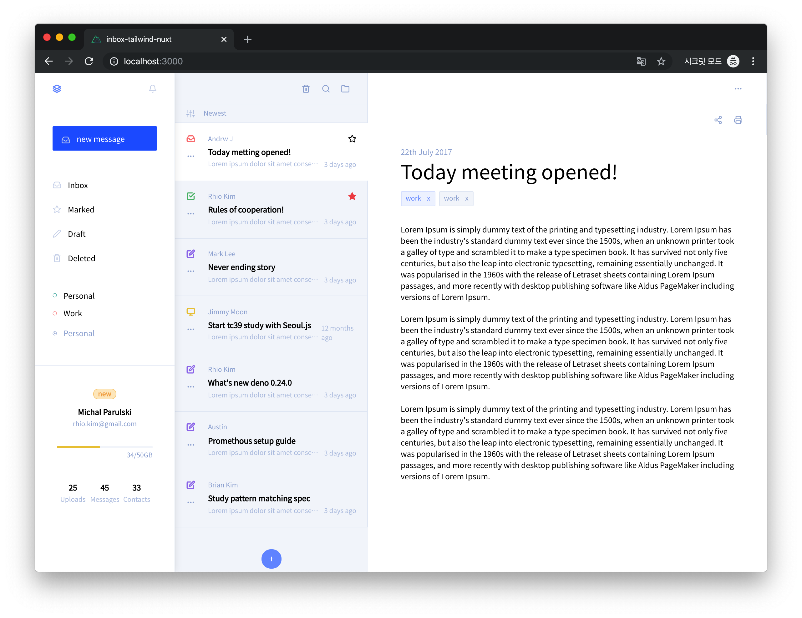
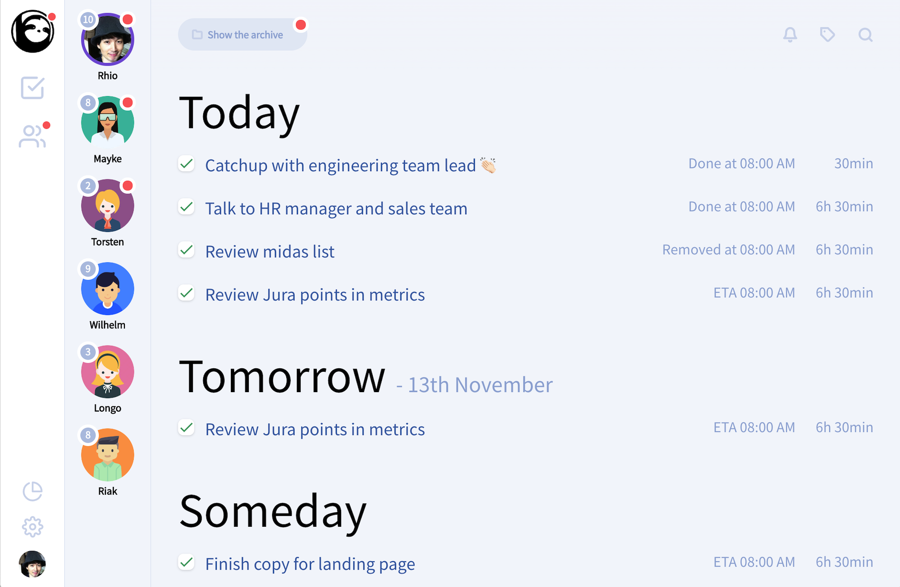

# inbox-tailwind-nuxt

> Inbox & Task Manager App with tailwind and nuxt

## Build Setup

``` bash
# install dependencies
$ yarn install

# serve with hot reload at localhost:3000
$ yarn dev

# build for production and launch server
$ yarn build
$ yarn start

# generate static project
$ yarn generate
```

For detailed explanation on how things work, check out [Nuxt.js docs](https://nuxtjs.org).

## Screenshots


[design resource](https://dribbble.com/shots/4074232-Inbox-Web-App)


[design resource](https://dribbble.com/shots/7174157-GipsyBot-Concepts)

## Resources

* Design - https://dribbble.com/shots/4074232-Inbox-Web-App#shot-description
* https://feathericons.com/